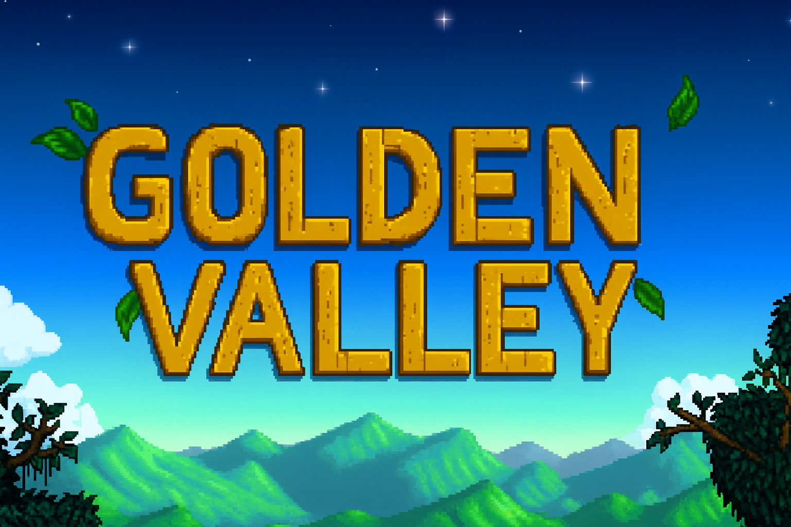

<div align="center">
  <br />
      
  <br />
  <div>
    
    
  </div>
  <h3 align="center">Golden Valley</h3>
  <div align="center">
    Um jogo 2D de simulação de fazenda desenvolvido por alunos da PUC Campinas na disciplina de Programação Orientada a Objetos (2025.2)
  </div>
</div>

## 📋 <a name="table">Sumário</a>

1. 🤖 [Introdução](#introducao)
2. ⚙️ [Tecnologias](#tecnologias)
3. 🔋 [Funcionalidades](#funcionalidades)
4. 📁 [Estrutura de Pastas](#estrutura)
5. 🤸 [Como Rodar](#rodar)
6. 🤝 [Contribuição](#contribuicao)

## <a name="introducao">🤖 Introdução</a>

Golden Valley é um jogo 2D de simulação de vida na fazenda, onde o jogador explora mapas, interage com diferentes terrenos e obstáculos, e vivencia o cotidiano rural. O projeto foi desenvolvido com foco em boas práticas de orientação a objetos e modularidade, servindo como base para estudos e expansão.

## <a name="tecnologias">⚙️ Tecnologias</a>

- Java 17+
- Gradle
- Swing/AWT (renderização gráfica)
- Programação Orientada a Objetos

## <a name="funcionalidades">🔋 Funcionalidades</a>

- 🎮 Movimentação fluida do personagem principal
- 🗺️ Mapas customizáveis via arquivos `.txt`
- 🌳 Terrenos variados: grama, água, terra, areia, árvores, paredes, etc.
- 🕹️ Sprites animados para o jogador
- 🚧 Detecção de colisão com obstáculos
- 🧩 Estrutura modular e expansível

## <a name="estrutura">📁 Estrutura de Pastas</a>

```
GoldenValley/
├── build.gradle.kts
├── src/
│   ├── main/
│   │   ├── java/
│   │   │   └── com/goldenvalley/
│   │   │       ├── GoldenValley.java
│   │   │       ├── core/
│   │   │       ├── entities/
│   │   │       ├── handlers/
│   │   │       └── terrains/
│   │   └── resources/
│   │       ├── assets/
│   │       │   ├── player/
│   │       │   └── tiles/
│   │       └── maps/
│   └── test/
├── build/
└── ...
```

- **core/**: Componentes centrais do motor do jogo
- **entities/**: Entidades do jogo (jogador, NPCs)
- **handlers/**: Manipuladores de eventos (teclado, etc.)
- **terrains/**: Gerenciamento de tiles e mapas
- **assets/**: Imagens dos personagens e tiles
- **maps/**: Mapas do jogo em `.txt`

## <a name="rodar">🤸 Como Rodar Localmente</a>

1. **Pré-requisitos:**
   - Java 17 ou superior
   - Gradle instalado (ou use o wrapper incluso)

2. **Clone o repositório:**
   ```sh
   git clone <url-do-repositorio>
   cd GoldenValley
   ```

3. **Compile o projeto:**
   ```sh
   ./gradlew build
   ```
   Ou no Windows:
   ```sh
   gradlew.bat build
   ```

4. **Execute o jogo:**
   ```sh
   ./gradlew run
   ```
   Ou:
   ```sh
   java -cp build/libs/GoldenValley-1.0-SNAPSHOT.jar com.goldenvalley.GoldenValley
   ```

## <a name="contribuicao">🤝 Contribuição</a>

Contribuições são bem-vindas! Sinta-se à vontade para abrir issues ou pull requests com melhorias, correções ou novas funcionalidades.

---

Desenvolvido para fins educacionais na disciplina de Programação Orientada a Objetos da PUC Campinas.
